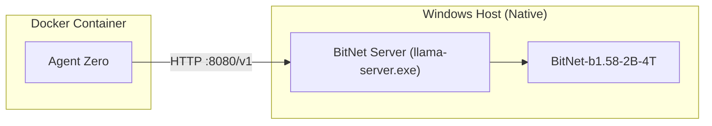

# Agent Zero + BitNet b1.58 (Hybrid Architecture)

> **High-Performance Local Intelligence on Windows ARM64**

This repository contains the configuration and scripts to run **Agent Zero** backed by Microsoft's **BitNet b1.58** inference engine. This setup uses a **Hybrid Architecture** to maximize performance on Windows ARM64 devices (like Surface Laptop 7 / Copilot+ PCs):

- **Inference Server**: Native Windows C++ (`bitnet.cpp`) for raw performance (No Docker overhead).
- **Agent Framework**: Agent Zero running in Docker, connected via local networking.

## 🚀 Features

- **True 1.58-bit Quantization**: Uses the official `bitnet.cpp` implementation for maximum speed and energy efficiency.
- **Native ARM64 Support**: Fully compiled for Windows ARM64 with NEON/DotProd/i8mm optimizations.
- **OpenAI-Compatible API**: Provides a standard endpoint (`/v1`) that Agent Zero (or any other tool) can consume easily.
- **Zero-Config Startup**: Includes `run_bitnet_server.ps1` to launch the server instantly.

---

## 🛠️ Prerequisites

- **Windows 11 on ARM64** (e.g., Snapdragon X Elite)
- **Visual Studio 2022** with C++ ARM64 Build Tools
- **Docker Desktop** (for running Agent Zero)

## 📦 Installation & Build

(If you haven't built the binaries yet)

1.  **Clone this repository**
2.  **Build BitNet**:
    ```powershell
    cmake -B build -G Ninja -DCMAKE_SYSTEM_PROCESSOR=ARM64 ... (see docs)
    cmake --build build --config Release --target llama-server
    ```
    *(Note: This repo assumes you have already compiled `llama-server.exe` into `build/bin/`)*

3.  **Download Model**:
    Ensure `ggml-model-i2_s.gguf` is present in `models/BitNet-b1.58-2B-4T/`.

---

## 🏃 Usage

### 1. Start the Inference Server
Run the included PowerShell script to launch the high-performance native server:

```powershell
.\run_bitnet_server.ps1
```

- **URL**: `http://localhost:8080/v1`
- **Documentation**: `http://localhost:8080/docs`

### 2. Connect Agent Zero
Run Agent Zero (in Docker) and point it to your host's native server:

```powershell
docker run -it --rm `
  -p 50001:80 `
  -v "${HOME}/.agent-zero:/app/work_dir" `
  --add-host=host.docker.internal:host-gateway `
  frdel/agent-zero:latest
```

**Agent Zero Config (`agent-zero/config/chat_models.json`):**

```json
{
  "bitnet": {
    "provider": "openai",
    "name": "bitnet-b1.58-2B-4T",
    "kwargs": {
      "base_url": "http://host.docker.internal:8080/v1",
      "api_key": "bitnet-local"
    }
  }
}
```

---

## 📂 Repository Structure

- `run_bitnet_server.ps1` - **Start Here**. Launches the native inference server.
- `utils/` - Helper scripts for quantization and codegen.
- `src/` & `include/` - Core BitNet C++ implementation.

---

## 🏗️ Architecture



---

*Verified on Surface Laptop 7 (Snapdragon X Elite)*
